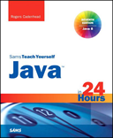

```
Roberto Nogueira  BSd EE, MSd CE
Solution Integrator Experienced - Certified by Ericsson
```

# Java in 24 hours



## Table of Contents

```
Table of Contents

Part I: Getting Started
[x] Hour 1: Becoming a Programmer
[x] Hour 2: Writing Your First Program
[x] Hour 3: Vacationing in Java
[x] Hour 4: Understanding How Java Programs Work
Part II: Learning the Basics of Programming
[ ] Hour 5: Storing and Changing Information in a Program
[ ] Hour 6: Using Strings to Communicate
[ ] Hour 7: Using Conditional Tests to Make Decisions
[ ] Hour 8: Repeating an Action with Loops
Part III: Working with Information in New Ways
[ ] Hour 9: Storing Information with Arrays
[ ] Hour 10: Creating Your First Object
[ ] Hour 11: Describing What Your Object is Like
[ ] Hour 12: Making the Most of Existing Objects
Part IV: Programming a Graphical User Interface
[ ] Hour 13: Building a Simple User Interface
[ ] Hour 14: Laying Out a User Interface
[ ] Hour 15: Responding to User Input
[ ] Hour 16: Building a Complex User Interface
Part V: Moving into Advanced Topics
[ ] Hour 17: Creating Interactive Web Programs
[ ] Hour 18: Handling Errors in a Program
[ ] Hour 19: Creating a Threaded Program
[ ] Hour 20: Reading and Writing Files
Part VI: Writing Internet Applications
[ ] Hour 21: Reading and Writing XML Data
[ ] Hour 22: Creating Web Services with JAX-WS
[ ] Hour 23: Working with Java2D Graphics
[ ] Hour 24: Writing Android Apps
Appendixes
[ ] Hour A: Using the NetBeans Integrated Development Environment
[ ] Hour B: Where to Go from Here: Java Resources
[ ] Hour C: This Book's Web Site
[ ] Hour D: Setting Up an Android Development Environment
```
